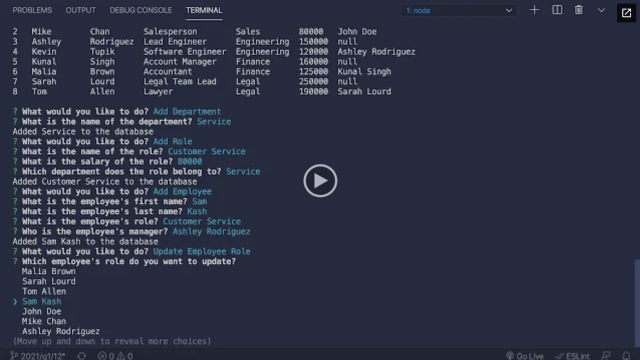

# Employee-Management-System


## Table of Contents
- [Description](#description)
- [Technologies](#technologies)
- [Installation](#installation)
- [Usage](#usage)
- [License](#license)
- [Contributing](#contributing)
- [Tests](#tests)
- [Questions](#questions)


---

## Deployment




- [Video Demonstration](https://drive.google.com/file/d/1r2o1B59d7uUXKNJPEI51rqrRPR38F6v3/view?usp=sharing)


---
## User Story

```
AS A business owner
I WANT to be able to view and manage the departments, roles, and employees in my company
SO THAT I can organize and plan my business
```


---

## Description

```
GIVEN a command-line application that accepts user input
WHEN I start the application
THEN I am presented with the following options: view all departments, view all roles, view all employees, add a department, add a role, add an employee, and update an employee role
WHEN I choose to view all departments
THEN I am presented with a formatted table showing department names and department ids
WHEN I choose to view all roles
THEN I am presented with the job title, role id, the department that role belongs to, and the salary for that role
WHEN I choose to view all employees
THEN I am presented with a formatted table showing employee data, including employee ids, first names, last names, job titles, departments, salaries, and managers that the employees report to
WHEN I choose to add a department
THEN I am prompted to enter the name of the department and that department is added to the database
WHEN I choose to add a role
THEN I am prompted to enter the name, salary, and department for the role and that role is added to the database
WHEN I choose to add an employee
THEN I am prompted to enter the employee’s first name, last name, role, and manager, and that employee is added to the database
WHEN I choose to update an employee role
THEN I am prompted to select an employee to update and their new role and this information is updated in the database 
```

## Technologies
```
- JavaScript
- Node.js
- MYSQL
```

## Installation
```
npm i
```
```
npm i inquirer
```
```
npm i console.table
```
```
npm i mysql 
```
## Usage
```
Run npm start and go to listining port
```

## Contributing
```
All you need is Name and Github link
```

## Test
```
To run; run - npm start
```

## Questions:

If you have any questions about the repo, open an issue or contact me at eliasvasque7@gmail.com. You can find more of my work at [gokublue007](https://github.com/gokublue007)! Thank You!


## Contact Information:

  - Github: [gokublue007](https://github.com/gokublue007)
  - Email: [eliasvasque7@gmail.com](user@example.com) 


[Back To The Top](#read-me-template)

